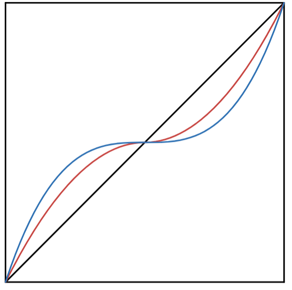

this is a list of notes about the code/interesting things in said code

 ## cool things
 * input squaring
    * when controlling things like a drivetrain, you want to be able to have the full range of movement,
    but also need high precision at low speeds. 
    * when you square the input from a joystick, the robot's motion will be precise when at low speeds, but you will still have the full range of speed
    * this graph shows input squaring
    * 
        * the black shows a liner relation between user input and output speed
        * the red is after squaring the input and reaplying the sign(multiply by x/|x|)
        * the blue is after cubing the input
    * when you square(or cube) the input from the joystick, your drive will have better percision at low speeds, without loosing your top speed
    
----

 * encoder distenceperPulse is 2pi(r)/encoderCPR(countsPerRev?) when no gearbox
    * account for gearbox in this calc, then encoder data can be taken by kinematics and sysid